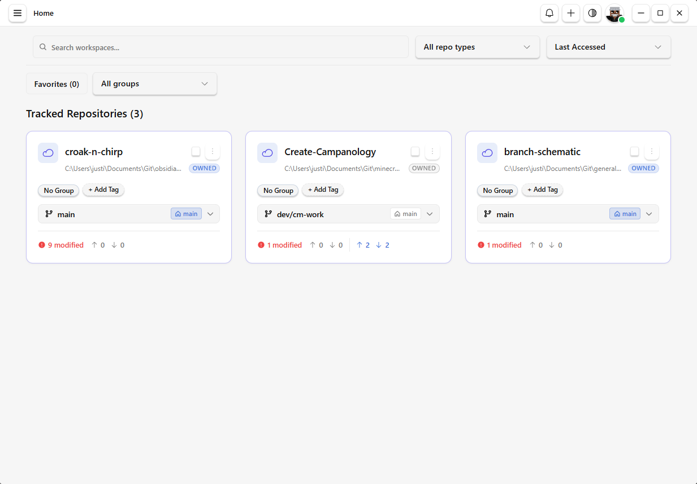

# Branch Schematic

A local-first desktop application for tracking GitHub repositories, exploring branch history, and organizing work across multiple projects from a canvas-based workspace.

- Desktop shell: Tauri v2 (Rust backend)
- UI: React 19
- Data layer: SQLite via @tauri-apps/plugin-sql

## Overview

Branch Schematic is designed to help developers manage repository context, branch relationships, and project-level organization in a desktop-first experience. The interface emphasizes a visual workspace that can scale across multiple repositories and workflows.



## Architecture & Project Layout

The application follows a feature-first structure to keep the codebase organized and easy to extend.

```text
src/
├── components/          # Shared, reusable UI primitives
├── features/            # Feature-specific code by domain
│   └── <feature-name>/
│       ├── components/
│       ├── hooks/
│       ├── stores/
│       └── types/
├── hooks/               # Cross-cutting hooks
├── lib/                 # Shared libraries and integrations
├── routes/              # Route definitions
├── stores/              # Global application state
└── types/               # Shared TypeScript types
```

### Folder Conventions

- Place feature-specific code under `src/features/<feature-name>/`.
- Keep each feature organized into `components/`, `hooks/`, `stores/`, and `types/`.
- Keep shared, reusable UI components in `src/components/<component-name>/`.
- Favor small, modular, single-responsibility components. When a component grows too complex, split it into smaller components or dedicated files.

## Prerequisites & Tooling

Before getting started, make sure the required tooling is installed:

- Node.js v20 or newer
- Rust toolchain (recommended latest stable)
- Platform build tools for Tauri:
  - Windows: Visual Studio Build Tools with C++ workload
  - macOS: Xcode Command Line Tools
  - Linux: required system libraries for WebKit and native dependencies

## Getting Started

Install dependencies:

```bash
npm install
```

Or with pnpm:

```bash
pnpm install
```

Run the app locally in development mode:

```bash
npm run tauri dev
```

Build production desktop binaries:

```bash
npm run tauri build
```

## Database Management & Schema Specification

Branch Schematic uses SQLite locally through `@tauri-apps/plugin-sql` for persisted application state and local data storage.

- The current schema and ER diagram are documented in `docs/Database.md`.
- This file is generated from the Rust database migration logic in `src-tauri/src/db.rs`.
- When Rust migrations change, regenerate the database documentation to keep it in sync.

```bash
npm run docs:db
```

## Documentation Maintenance

The project includes two key maintenance artifacts:

- `docs/CODEBASE_MAP.md` provides a snapshot of the project structure, dependencies, and architecture.
- `docs/Database.md` captures the schema specification and ER diagram for the local SQLite database.

After file moves, architectural changes, or major refactors, regenerate both documentation assets:

```bash
npm run docs:code
npm run docs:db
```