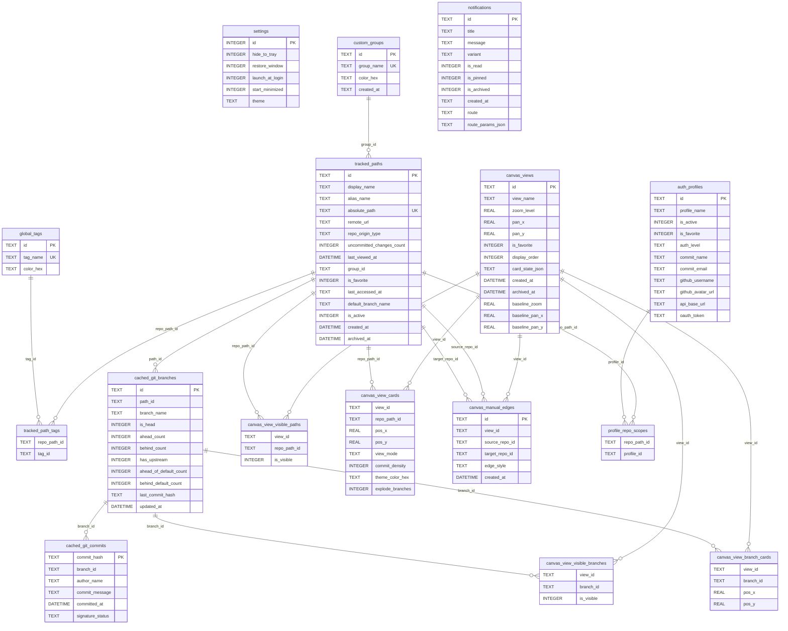

# Database Schema Specification

*Auto-generated on 2026-07-02 from `db.rs` migrations.*

## Entity Relationship Diagram

```mermaid
erDiagram
    settings {
        INTEGER id PK
        INTEGER hide_to_tray
        INTEGER restore_window
        INTEGER launch_at_login
        INTEGER start_minimized
        TEXT theme
    }

    tracked_paths {
        TEXT id PK
        TEXT display_name
        TEXT alias_name
        TEXT absolute_path UK
        TEXT remote_url
        TEXT repo_origin_type
        INTEGER uncommitted_changes_count
        DATETIME last_viewed_at
        TEXT group_id
        INTEGER is_favorite
        TEXT last_accessed_at
        TEXT default_branch_name
        INTEGER is_active
        DATETIME created_at
        DATETIME archived_at
    }

    custom_groups {
        TEXT id PK
        TEXT group_name UK
        TEXT color_hex
        TEXT created_at
    }

    global_tags {
        TEXT id PK
        TEXT tag_name UK
        TEXT color_hex
    }

    tracked_path_tags {
        TEXT repo_path_id
        TEXT tag_id
    }

    canvas_views {
        TEXT id PK
        TEXT view_name
        REAL zoom_level
        REAL pan_x
        REAL pan_y
        INTEGER is_favorite
        INTEGER display_order
        TEXT card_state_json
        DATETIME created_at
        DATETIME archived_at
        REAL baseline_zoom
        REAL baseline_pan_x
        REAL baseline_pan_y
    }

    notifications {
        TEXT id PK
        TEXT title
        TEXT message
        TEXT variant
        INTEGER is_read
        INTEGER is_pinned
        INTEGER is_archived
        TEXT created_at
        TEXT route
        TEXT route_params_json
    }

    cached_git_branches {
        TEXT id PK
        TEXT path_id
        TEXT branch_name
        INTEGER is_head
        INTEGER ahead_count
        INTEGER behind_count
        INTEGER has_upstream
        INTEGER ahead_of_default_count
        INTEGER behind_default_count
        TEXT last_commit_hash
        DATETIME updated_at
    }

    canvas_view_visible_paths {
        TEXT view_id
        TEXT repo_path_id
        INTEGER is_visible
    }

    canvas_view_visible_branches {
        TEXT view_id
        TEXT branch_id
        INTEGER is_visible
    }

    cached_git_commits {
        TEXT commit_hash PK
        TEXT branch_id
        TEXT author_name
        TEXT commit_message
        DATETIME committed_at
        TEXT signature_status
    }

    canvas_view_cards {
        TEXT view_id
        TEXT repo_path_id
        REAL pos_x
        REAL pos_y
        TEXT view_mode
        INTEGER commit_density
        TEXT theme_color_hex
        INTEGER explode_branches
    }

    canvas_view_branch_cards {
        TEXT view_id
        TEXT branch_id
        REAL pos_x
        REAL pos_y
    }

    canvas_manual_edges {
        TEXT id PK
        TEXT view_id
        TEXT source_repo_id
        TEXT target_repo_id
        TEXT edge_style
        DATETIME created_at
    }

    auth_profiles {
        TEXT id PK
        TEXT profile_name
        INTEGER is_active
        INTEGER is_favorite
        TEXT auth_level
        TEXT commit_name
        TEXT commit_email
        TEXT github_username
        TEXT github_avatar_url
        TEXT api_base_url
        TEXT oauth_token
    }

    profile_repo_scopes {
        TEXT repo_path_id
        TEXT profile_id
    }


    custom_groups ||--o{ tracked_paths : "group_id"
    tracked_paths ||--o{ tracked_path_tags : "repo_path_id"
    global_tags ||--o{ tracked_path_tags : "tag_id"
    tracked_paths ||--o{ cached_git_branches : "path_id"
    canvas_views ||--o{ canvas_view_visible_paths : "view_id"
    tracked_paths ||--o{ canvas_view_visible_paths : "repo_path_id"
    canvas_views ||--o{ canvas_view_visible_branches : "view_id"
    cached_git_branches ||--o{ canvas_view_visible_branches : "branch_id"
    cached_git_branches ||--o{ cached_git_commits : "branch_id"
    canvas_views ||--o{ canvas_view_cards : "view_id"
    tracked_paths ||--o{ canvas_view_cards : "repo_path_id"
    canvas_views ||--o{ canvas_view_branch_cards : "view_id"
    cached_git_branches ||--o{ canvas_view_branch_cards : "branch_id"
    canvas_views ||--o{ canvas_manual_edges : "view_id"
    tracked_paths ||--o{ canvas_manual_edges : "source_repo_id"
    tracked_paths ||--o{ canvas_manual_edges : "target_repo_id"
    tracked_paths ||--o{ profile_repo_scopes : "repo_path_id"
    auth_profiles ||--o{ profile_repo_scopes : "profile_id"
```
