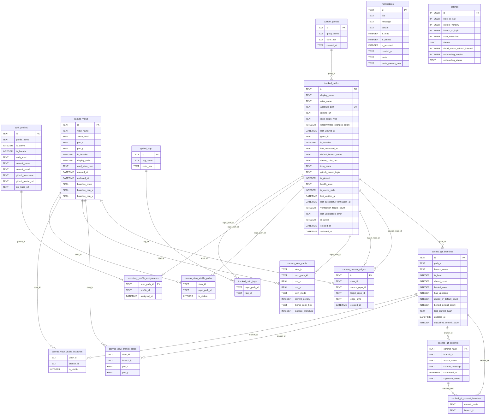

# Database Map

## Sources

- `src-tauri/src/db.rs`

## Entity Relationship Diagram

## Tables

| Table | Columns |
| --- | --- |
| `auth_profiles` | 10 |
| `cached_git_branches` | 12 |
| `cached_git_commit_branches` | 2 |
| `cached_git_commits` | 6 |
| `canvas_manual_edges` | 6 |
| `canvas_view_branch_cards` | 4 |
| `canvas_view_cards` | 8 |
| `canvas_view_visible_branches` | 3 |
| `canvas_view_visible_paths` | 3 |
| `canvas_views` | 13 |
| `custom_groups` | 4 |
| `global_tags` | 3 |
| `notifications` | 10 |
| `repository_profile_assignments` | 3 |
| `settings` | 9 |
| `tracked_path_tags` | 2 |
| `tracked_paths` | 25 |

## Profile assignment and alpha reset policy

`repository_profile_assignments` contains at most one row per tracked repository. The
assignment is authoritative and uses a restrictive profile foreign key: deleting a
profile is blocked until its repositories are reassigned or explicitly cleared.
Repositories without a row inherit the persisted active non-fallback profile, or
`local-basic-profile` when no user profile exists. Clearing a row restores that
inheritance.

The former `profile_repo_scopes` data is intentionally not migrated. Alpha databases
may contain ambiguous many-to-many mappings, so users must delete the SQLite database
(including `-wal` and `-shm` files), launch once to recreate and migrate a blank
database, and re-import repositories. Do not attempt to select a winner from legacy
assignment rows.
