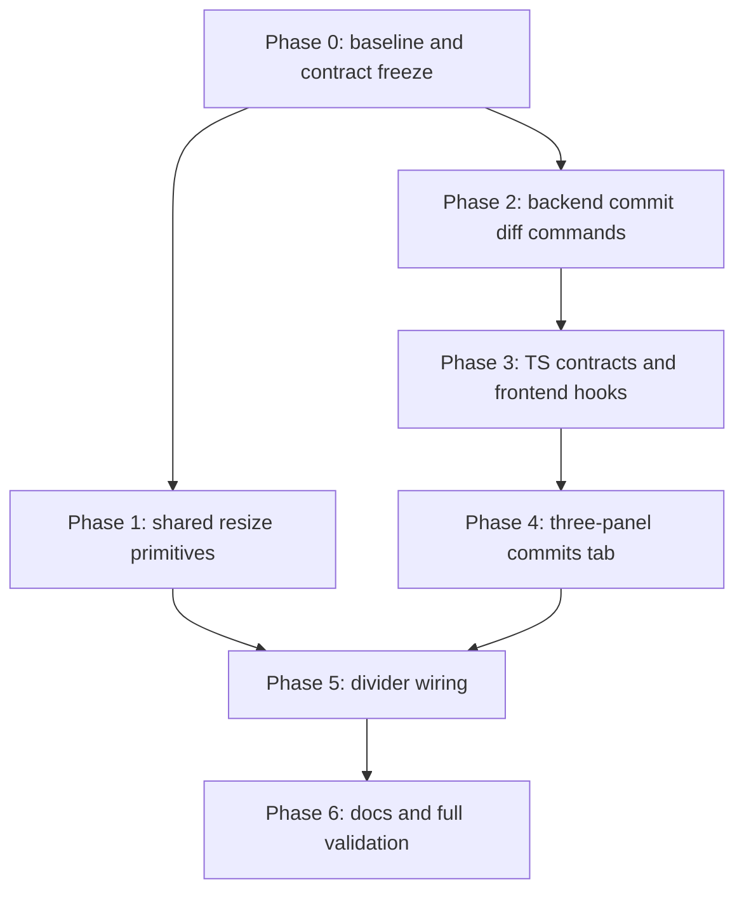

# Git Commit Diff Viewer Implementation Plan

## Purpose

This document converts [git-diff-spec.md](git-diff-spec.md) into an ordered, phased implementation program. Each phase has a bounded scope, explicit prerequisites, a validation gate, and a handoff condition. The [Changes-tab resize adoption spec](changes-tab-resize-adoption-spec.md) is intentionally **out of scope here**; it consumes the primitives created in Phase 1 but is sequenced separately.

The source of truth for behavior, contracts, and edge cases is the spec. This plan only orders the work and defines gates; if this document and the spec disagree, the spec wins and the discrepancy must be resolved before proceeding.

## Operating Rule

Each phase is written to be implementable in a fresh context after the preceding phase's gate passes. The implementing agent must:

- Read the spec sections cited in the phase before editing.
- Implement only the current phase unless a prerequisite is proven incomplete.
- Keep command names, struct/type field names, clamp bounds, and class names exactly as specified.
- Run the phase validation commands and record results before handing forward.
- Not modify the Changes tab, `useResizableChangesPanels`, or any Changes-tab test (regression surface).

Phases 1 and 2 have disjoint ownership (frontend primitives vs. Rust backend) and may run in parallel by separate agents.

## Dependency Graph

Critical path: `P0 → P2 → P3 → P4 → P5 → P6`. Phase 1 is independent of the backend chain and only gates Phase 5.

## Normative Contracts (fixed during implementation)

Restated from the spec; treat as immutable without an approved discrepancy record:

- New commands: `get_commit_changed_files(absolute_path, commit_hash)` and `get_commit_file_diff(absolute_path, commit_hash, path)`; the latter returns the existing `RepositoryFileDiff` verbatim.
- Merge commits diff against first parent only; root commits diff against the empty tree; short hashes are rejected server-side.
- 512 KB patch cap and binary/truncation guard rails mirror `get_repository_file_diff`.
- Clamp configs: divider 1 `{ minRatio: 0.18, maxRatio: 0.45, minPx: 280 }`; divider 2 `{ minRatio: 0.20, maxRatio: 0.60, minPx: 200 }`; defaults ~22% shell / ~20% region.
- Ratios are session-scoped component state, independent per tab; no persistence.
- Responsive breakpoint: below 900px the shell stacks vertically and dividers hide.
- The Changes tab and its hook/tests remain untouched through all phases.

## Phase 0: Baseline and Contract Freeze

**Goal**: Establish that the regression surface is green before anything changes, and pin fixture decisions.

Scope:
- Run the full existing frontend suite and the Rust test suite; record results as the baseline.
- Confirm the fixture-repository approach for cargo tests (inspect how `test_get_repository_file_diff_returns_changed_and_untracked_text` builds fixtures; reuse its pattern).
- Verify current Commits-tab rendering and the two placeholder buttons exist as described (spec: Current State).
- Confirm `RepositoryDiffPreview`, `parsePatch`, `buildSplitRows` require no changes.

Validation gate:
- `npm run test` — all passing.
- `cargo test` (in `src-tauri`) — all passing.

Handoff condition: baseline recorded; no open questions about fixture patterns or current behavior.

## Phase 1: Shared Resize Primitives

**Goal**: Create `useResizablePanels` and `ResizeDivider` with zero feature consumers (tests only), so later wiring is additive.

Spec reference: Architecture Plan rows 1–2; Resizing section; Accessibility section; Testing Plan (shared primitives bullet).

Deliverables:
- `src/hooks/useResizablePanels.ts`: config array `{ id, defaultRatio, minRatio, maxRatio, minPx?, maxPx? }[]`; returns `registerContainer(id)`, per-id `ratios`, `startResize(id)`, `isResizing`. Drag-time clamping converts px bounds against the live rect (`effectiveMin = max(minRatio, minPx / rect.width)`, mirrored for maxima). Global cursor/`user-select` lock during drag; restored on release and unmount.
- `src/components/resize-divider/ResizeDivider.tsx` + `ResizeDivider.css`: separator with drag wiring, native-drag prevention, aria value attributes from effective bounds, ArrowLeft/ArrowRight nudging within clamps. Base `.resize-divider` styles ported conceptually from `.repository-view-changes-divider` (do **not** remove or alter the Changes-tab rules in this phase).
- Tests: `useResizablePanels.test.ts` (clamp math incl. px conversion at multiple widths, per-divider independence, drag lifecycle) and `ResizeDivider.test.tsx` (aria values, keyboard nudge, mousedown start/default-prevented).

Explicitly out of scope: touching `useResizableChangesPanels`, `RepositoryDetail.css`, or any tab component.

Validation gate:
- `npm run test` — new primitive suites pass; all existing suites still pass.
- `npm run build` — typecheck clean.

Handoff condition: primitives exported and tested; API matches the spec table verbatim.

## Phase 2: Backend Commit Diff Commands

**Goal**: Ship both Tauri commands with guard rails and fixture-backed cargo tests.

Spec reference: New backend commands; State/Edge Cases (merge/root/binary/truncated); Testing Plan (backend).

Deliverables:
- Shared helper resolving commit + parent tree (first parent, else empty tree), used by both commands.
- `get_commit_changed_files`: tree-to-tree diff with `find_similar`, status mapping, `old_path` for renames/copies, binary flags, path-ascending sort.
- `get_commit_file_diff`: pathspec-scoped diff returning `RepositoryFileDiff` with `unavailable_reason`/`is_binary`/`bounded_diff_patch` semantics identical to `get_repository_file_diff`.
- Commands registered in `lib.rs` invoke handler.
- Cargo tests adjacent to the existing file-diff test: modified, added, deleted, renamed, root commit, binary, truncation cap.

Validation gate:
- `cargo test` — new tests pass, no regressions.

Handoff condition: both commands invocable and documented in code; IPC doc update deferred to Phase 6.

## Phase 3: TypeScript Contracts and Data Hooks

**Goal**: Mirror the Rust payloads in `src/types/git.ts` and ship the two lazy-loading hooks.

Spec reference: Data contracts; Architecture Plan rows 3–4; State/Caching (stale-response safety, reset cascade); Testing Plan (hook tests).

Deliverables:
- `CommitChangeStatus`, `CommitChangedFile` in `src/types/git.ts`; reuse `RepositoryFileDiff` unchanged.
- `hooks/useCommitChangedFiles.ts`: `{ files, isLoading, error, clearFiles }`, `isCurrent` cancellation pattern.
- `hooks/useCommitFileDiff.ts`: `{ fileDiff, isDiffLoading, diffError, clearFileDiff }`, same pattern.
- Hook tests (mocked `invoke`): success, error, stale-response suppression.

Validation gate:
- `npm run test` — hook suites pass; `npm run build` — clean.

Handoff condition: hooks consume real command names and return shapes match the spec exactly.

## Phase 4: Three-Panel Commits Tab

**Goal**: Replace the two-column grid with the full three-panel UI at static default widths (no dividers yet), including selection cascade, edge states, and responsive stacking.

Spec reference: Desired User Experience (all columns, detail-panel removal, interaction flow); State/Caching/Edge Cases; Styling Notes; Accessibility (file rows, toggle); Testing Plan (CommitsTab bullets excluding divider dragging).

Deliverables:
- `RepositoryCommitFilesPanel.tsx`: collapsible summary strip (collapsed default, resets on commit change), sorted file list with status badges, `oldPath → newPath` renames, `is-selected` treatment, per-commit count header.
- `RepositoryCommitDiffPanel.tsx`: header with truncated path + view-mode toggle; body delegates to `RepositoryDiffPreview`; empty/binary/truncated/error notices.
- `RepositoryDetailCommitsTab.tsx`: three-panel flex shell (`repository-view-history-shell`), owns `viewMode`, selected-file state, and the auto-select/reset cascade (first commit → files → first file → diff; commit/branch/dialog resets clear downstream state).
- `RepositoryDetailBody.tsx` / `RepositoryDetail.tsx`: thread `absolutePath` (or `repo`) down; old detail panel and placeholder buttons removed.
- CSS: shell/panel classes modeled on `.repository-view-changes-*`; below 900px stack vertically (dividers simply not rendered yet).
- Tests: extend `RepositoryDetailCommitsTab.test.tsx` — loading/empty/loaded states, fetch-on-select chains, badge rendering, unified/split toggle, empty-commit and binary/truncated states.

Note: use the static default ratios (~22% / ~20% / remainder) as inline flex-basis values in this phase; they become hook-driven in Phase 5.

Validation gate:
- `npm run test` — new and updated suites pass; `RepositoryDetailChangesTab.test.tsx` untouched and green.
- `npm run build` — clean.
- Manual: dialog opens on a real repo; selecting commits/files streams correctly; narrow-window stacking works.

Handoff condition: feature is usable end-to-end without resizing.

## Phase 5: Divider Wiring

**Goal**: Activate resizing via the Phase 1 primitives.

Spec reference: Resizing section; Accessibility (divider labels/values); Styling Notes (dividers); Testing Plan (divider dragging bullet).

Deliverables:
- Wire `useResizablePanels` with both configs (normative bounds above): divider 1 registered on the outer shell, divider 2 on the inner files+diff region.
- Two `ResizeDivider`s between panels with labels "Resize commit history panels" / "Resize commit file panels"; replace static flex-basis values with hook ratios.
- Responsive rule: dividers hidden below 900px.
- Test: simulated mouse drags adjust panel flex-basis within clamp bounds; keyboard nudge works.

Validation gate:
- `npm run test` — all green; `npm run build` — clean.
- Manual: drag each divider; verify px floors hold when the dialog is narrow; verify divider-2 ratio doesn't drift when divider 1 moves.

Handoff condition: resizing behaves per spec at multiple window sizes.

## Phase 6: Documentation and Full Validation

**Goal**: Regenerate generated docs and prove the whole MVP against the spec checklist.

Deliverables:
- Update `docs/arch/IPC_COMMANDS.md` with both new commands (or regenerate via `npm run docs:ipc` if arch-snap covers it); refresh `COMPONENT_TREE.md` where applicable (`npm run docs:components`).
- Full MVP checklist walk-through against the spec (Included list, Resolved Decisions 1–5).
- Confirm Deferred list contains nothing accidentally implemented.

Validation gate:
- `npm run test`, `npm run build`, `cargo test` — all green together.
- Manual pass of the Interaction flow steps 1–6 from the spec on a repository with: root commit, merge commit, empty commit, rename, binary file, and a >512 KB text change.

Handoff condition: MVP complete; follow-up work limited to items already listed under Deferred and the Changes-tab adoption spec.
