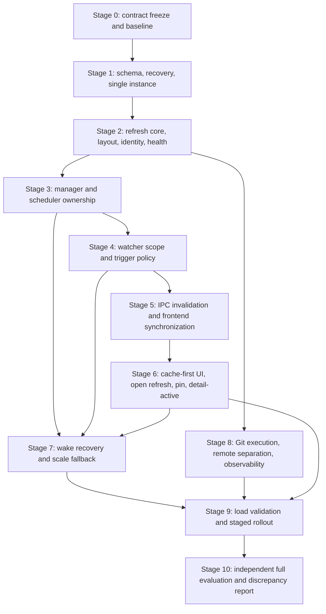

# Repository Update Detection and Refresh Implementation Plan

## Purpose

This document converts [repository-update-detection-plan.md](repository-update-detection-plan.md) into an ordered implementation program. It is written as a handoff for separate downstream agents or separate implementation contexts. Each stage has a bounded scope, explicit prerequisites, a validation gate, and a handoff condition for the next stage.

The target product is the Tauri desktop application described in [Technical-Architecture.md](../Technical-Architecture.md). The current implementation has watcher, debounce, indexing, and notification responsibilities combined in [src-tauri/src/daemon.rs](../../src-tauri/src/daemon.rs); watcher startup is currently requested from [src/features/branch-map/BranchMap.tsx](../../src/features/branch-map/BranchMap.tsx); and workspace hydration is owned by [src/stores/workspace-store.ts](../../src/stores/workspace-store.ts). The order below deliberately moves ownership before changing behavior.

## Audience and Operating Rule

The reader of each stage is an implementation agent working in a fresh context after the preceding stage has been validated. The agent must:

- Read this document and the original design plan before editing.
- Inspect the current working tree and the completed-stage report before making changes.
- Implement only the current stage unless a documented prerequisite is proven incomplete.
- Preserve the legacy watcher path while the feature flag is disabled.
- Keep public contracts, SQL column names, event payloads, and health-state values exactly aligned with this document.
- Run the stage validation before handing work forward.
- Report changed files, commands run, results, known gaps, and any discrepancy with the design.

Within a stage, work may be split between agents only when ownership is disjoint. The integrating agent owns shared files such as `src-tauri/src/lib.rs`, `src-tauri/src/db.rs`, `src/stores/workspace-store.ts`, and the generated documentation files. Do not have parallel agents edit the same file.

## Stage Reports and Evidence

Each completed stage must produce a report at `docs/plans/reports/repository-update-detection-stage-<n>.md` before its handoff gate can pass. The report must contain the stage decision record, changed files, exact commands and environment, test results, manual checks, fixture or benchmark data, known gaps, and discrepancies requiring approval. Stage 0 must create the reports directory and record the migration, identity, feature-flag, and rollout-owner decisions there; later stages must link to the preceding report rather than restating it.

An implementation agent may not mark a manual or platform-specific check as passed without recording the machine/OS, fixture, steps, observed result, and evidence location. An unrun check is `unverified`, not `passed`. Generated documents are outputs, not stage reports, and must not be used as a substitute for validation evidence.

## Review Summary

### What the Design Gets Right

- It correctly identifies that repository monitoring must be a lifecycle service rather than a branch-map side effect.
- It defines `workspace-updated` as cache invalidation, not as a second repository-data source.
- It protects the last-known cache on refresh failure and requires authoritative full-refresh reconciliation.
- It distinguishes durable repository health and pinning from transient watcher, queue, and priority state.
- It sets concrete scale and latency targets instead of treating large-workspace support as an unmeasured aspiration.
- It gives the detail view a separate working-tree status contract and keeps remote sync activity separate from local startup freshness.

### Corrections and Gates Required Before Implementation

1. **Migration numbering must be resolved first.** The current [src-tauri/src/db.rs](../../src-tauri/src/db.rs) already defines migrations 1, 2, and 3. The design says to modify migration 2, but editing an already-applied migration is only safe if the alpha reset requirement is genuinely enforced for every database under test. Stage 0 must confirm the reset policy and migration-plugin behavior. If an existing database must remain supported, the implementation must stop and obtain approval for a new migration instead of silently changing migration 2.
2. **The current database layer has compatibility mutation paths.** `ensure_tracked_paths_theme_columns` performs runtime `ALTER TABLE` work, while the design requires fail-fast schema validation. Stage 1 must either remove this compatibility path or strictly confine it to an explicitly supported legacy recovery path. No new repository-health command may read columns before schema readiness is established.
3. **Moved-repository detection is under-specified for local-only repositories.** Normalized `absolute_path` and `remote_url` do not prove that a replacement local repository at the same path is the original repository. Stage 0 must choose one policy: add a persisted Git identity signal, or limit `moved` to cases with explicit evidence such as a changed Git directory identity or a relink operation. Remote URL alone must never merge repositories or prove identity.
4. **The object-store rule is normative.** Earlier recommendations mention a full refresh for `.git/objects/**`, but the resolved decision is to avoid recursive object watching and to treat object-only activity as a verification hint. The resolved trigger matrix in the original plan supersedes the earlier wording.
5. **The current UI has competing refresh paths.** `BranchMap.tsx` starts watchers and polls every four seconds; the dashboard verifies paths separately; repository details load changes on mount; and the daemon emits success notifications. The new path must be proven before those paths are removed or narrowed, and feature-flag-off behavior must remain unchanged.
6. **The current cache schema has both a legacy branch-to-commit shape and migration 3 mapping rows.** Authoritative deletion must account for shared commit references through `cached_git_commit_branches`; it must not assume that deleting one branch-owned `branch_id` is sufficient.
7. **The scale targets need measurement boundaries.** The 4 KB per-repository target excludes OS-managed watcher allocations, and the 2,000-repository target does not require 2,000 live recursive watches. Benchmark reports must state these exclusions and report watcher and polling counts separately.
8. **The feature flag has no executable control contract.** The plan names a flag but does not define its source, evaluation time, override precedence, or rollback write path. Stage 0 must choose these explicitly; Stage 3 must evaluate one mode per process/workspace and expose the active mode in diagnostics so the legacy and new paths cannot accidentally coexist.
9. **Migration readiness is not yet a startup invariant.** Registering the Tauri SQL plugin and opening the SQLx pool in builder setup does not by itself prove which one completes first. Stage 1 must establish and test a single readiness barrier: migrations, required-schema validation, and runtime connection configuration must complete before any command or service can query the new columns.
10. **The event revision scope is ambiguous.** A process-local revision must have one defined ordering domain. Stage 5 must specify whether a revision is global or per repository, assign the same revision to all batches from one logical refresh, and test multi-batch delivery, duplicate delivery, listener teardown, and missed-event reconciliation.
11. **Watcher path registration is incomplete for absent or dynamic paths.** `refs`, `index`, and `packed-refs` may not exist at registration time and refs may be created later. Stage 4 must watch stable parent directories where necessary, filter logical paths, and test first-branch creation, packed-ref creation, and worktree/gitfile layouts.
12. **Watcher overflow and callback backpressure can lose the only hint.** The existing bounded channel ignores send failures. The new manager must treat channel overflow, watcher errors, and task termination as degraded health plus a scheduled verification, and tests must prove that no overflow silently leaves a repository clean.
13. **Cache deletion needs a precise orphan algorithm.** The existing schema has both `cached_git_commits.branch_id` and migration-3 mapping rows. Stage 2 must define deletion order and retain a commit while either a surviving mapping or a surviving legacy branch reference exists; the test must cover shared and unshared commits.
14. **Lifecycle coverage omits several current entry points.** Watcher startup and hydration also occur in database management and repository onboarding flows, while relink, archive, untrack, window close, and app exit need cleanup. Stage 3 must enumerate these call sites and prove each routes through the manager or the explicit legacy adapter.
15. **Detail-active status ownership is underspecified.** The plan names a status response and verification timestamp but does not say whether either is durable cache data or view-local state. Stage 6 must define the response contract, storage owner, invalidation boundary, and cancellation behavior so status refreshes cannot overwrite a newer repository selection.

These are implementation gates, not invitations to redesign the confirmed contracts. Any change to a confirmed contract must be recorded as a discrepancy and approved before proceeding.

## Normative Contracts

The following decisions are treated as fixed during implementation:

- The application has one running Rust process. Use `tauri-plugin-single-instance`; a second launch activates the existing window and forwards advisory arguments.
- One managed `WatcherManager`, one refresh scheduler, and one repository-cache writer queue are shared by all windows and views.
- `tracked_paths.is_active` remains tracking/archive state, not live foreground priority.
- Repository identity is based on normalized absolute path, with remote metadata used only as corroboration. Independent clones with the same remote remain distinct.
- Health states are `unverified`, `monitoring`, `monitoring_failed`, `healthy`, `unreachable`, `missing`, and `moved`.
- The durable health fields are `health_state`, `is_cache_stale`, `last_verified_at`, `last_successful_verification_at`, `verification_failure_count`, and `last_verification_error`. Runtime handles, retry timers, queued jobs, in-flight markers, and live priority are not persisted.
- The global detail-status interval is stored in `settings`, clamped to 2 through 5 seconds, and defaults to 5 seconds. It affects only the `detail-active` reconciliation poll.
- The persisted repository pin flag is stored on `tracked_paths`, defaults to false, and gives only a bounded five-minute startup boost.
- `workspace-updated` is version 1, emitted only after cache commit, idempotent, and limited to 250 repository IDs per batch.
- The event payload is:

	```text
	{
		version: 1,
		event_id: string,
		repository_ids: string[],
		trigger: string,
		revision: number,
		batch: number,
		total_batches: number,
		emitted_at: string
	}
	```

- Full refreshes are authoritative per repository. They upsert the current branch snapshot, remove absent branches and dependent mappings transactionally, and delete shared commit rows only after remaining references are checked.
- Filesystem events are hints. Git-derived verification remains mandatory through scheduled, wake, on-demand, or detail-active reconciliation.
- Live metadata watching is limited to logical `HEAD`, `refs`, `packed-refs`, and `index` paths after layout resolution. `.git/objects/**` is not recursively watched.
- Background and fallback work must use bounded concurrency, deduplication, trailing-edge debounce, a hard force-flush cap, retry backoff, and polling jitter.
- The feature flag defaults to the legacy path until internal correctness and load gates pass. There is no dual watcher registration for one repository.
- The feature flag is evaluated at startup from one documented local configuration source, with an explicit emergency-disable override taking precedence. It is process/workspace scoped, is observable through diagnostics, and changes only at a restart or an explicitly synchronized manager transition; rollout and rollback must never leave both watcher paths active for one repository.
- Every stage has an evidence report under `docs/plans/reports/`; missing evidence leaves its handoff gate blocked.
- Schema readiness is a prerequisite for all commands and services that read or write repository-health, pin, or detail-interval fields.
- A refresh outcome has one repository ID, one trigger reason, one cache-write result, and one revision. Health changes and cache writes are committed before `workspace-updated` is emitted; failed refreshes never delete last-known cache data.

## Dependency Graph



The critical path is `S0 -> S1 -> S2 -> S3 -> S4 -> S5 -> S6 -> S7 -> S8 -> S9 -> S10`. Stage 8 can begin its non-invasive Git profiling work after Stage 2, but its production changes must be integrated after the scheduler and event contracts exist.

## Stage 0: Contract Freeze and Baseline

### Objective

Turn the broad design into an implementation contract and record the current behavior before code changes begin.

### Dependencies

None. This stage is documentation, inspection, and baseline validation only.

### Work Packages

**Contract owner**

- Confirm whether alpha development databases are always deleted before this change.
- Confirm whether changing migration 2 is permitted despite the existing migration 3. If not confirmed, stop and request a migration-version decision.
- Choose the moved-repository evidence policy for local-only paths. Do not add a column or identity algorithm without recording the decision.
- Define the feature-flag source, default, scope, rollout owner, and legacy fallback behavior.
- Record the default flag source and precedence. The default is disabled; an emergency disable must be local, deterministic, and testable without network access. Record who owns enabling each rollout cohort and where the decision is persisted or supplied at startup.
- Adopt the conservative moved-identity policy unless a stronger persisted identity is approved: disappearance alone means `missing`; `moved` requires an explicit relink or verified Git-directory identity match; a reused path must never reattach the old row, and a shared remote URL must never prove identity.
- Freeze defaults and bounds: detail interval 5 seconds with bounds 2 to 5, event batch size 250, unreachable after 8 consecutive failures, retry cap 15 minutes, and the stated latency/scale targets.

**Baseline owner**

- Capture the existing test, build, and Rust compilation baseline.
- Record the current database migration versions and the exact application database path on Windows.
- Record the current watcher path from repository onboarding through `BranchMap.tsx`, `lib.rs`, and `daemon.rs`.
- Record the existing four-second branch-map poll and dashboard path verification behavior.
- Define repeatable fixture requirements for conventional repositories, gitfile worktrees, linked worktrees, submodules, bare repositories, packed refs, missing paths, and large object stores. Do not build the full load harness yet.
- Include fixtures for an absent-then-created `refs`/`index`/`packed-refs` path, symlinked and case-variant Windows paths, path reuse by an independent clone, watcher overflow, SQLite lock contention, and a repository whose Git command emits a sensitive path or token.

### Expected Outputs

- A completed decision record in the stage report with no unresolved schema or identity gate.
- Baseline command results and a short map of current refresh ownership.
- A benchmark fixture specification for later stages.
- Confirmation that the original design's resolved sections, not earlier conflicting recommendations, are the source of truth.

### Validation

- Run `npm test`.
- Run `npm run build`.
- Run `cargo test --manifest-path src-tauri/Cargo.toml` from the repository root.
- Verify that the current database reports migration 3 as the highest defined migration and that the reset/version decision is explicit.
- Verify that no production file was changed by this stage unless the stage report itself is being added.
- Write the Stage 0 report and verify that every decision and baseline result is either recorded as passed or explicitly marked unverified.

### Handoff Gate

Do not begin Stage 1 until the migration-numbering decision, moved-identity policy, feature-flag policy, and baseline results are written down. If any one is unresolved, the next agent must stop rather than infer a policy.

## Stage 1: Schema, Recovery, and Single-Instance Foundation

### Objective

Make the database and process lifecycle safe foundations for all later repository-refresh code.

### Dependencies

Stage 0 decisions are complete.

### Files and Ownership

- Backend schema and typed rows: [src-tauri/src/db.rs](../../src-tauri/src/db.rs).
- Startup, pool creation, plugin order, managed state, and shutdown: [src-tauri/src/lib.rs](../../src-tauri/src/lib.rs).
- Dependencies and lockfile: [src-tauri/Cargo.toml](../../src-tauri/Cargo.toml) and `Cargo.lock`.
- Recovery UI and commands: a feature-owned frontend surface, not raw SQL in a route component.
- Generated schema documentation: [docs/Database.md](../Database.md), regenerated with `npm run docs:db` after the migration is settled.

### Work Packages

**Migration and schema package**

- Add the detail interval to the existing `settings` row through the approved migration-2 reset strategy.
- Add `is_pinned` and all six health fields to `tracked_paths` with the exact defaults from the contract.
- Add typed row fields and typed read/write helpers.
- Validate and clamp the interval when reading it. Do not trust arbitrary stored values.
- Remove or quarantine ad hoc compatibility `ALTER TABLE` behavior so unsupported schema versions fail fast.
- Keep the SQLx runtime pool and Tauri SQL migration target on the exact same canonical path.
- Establish one startup readiness barrier after migrations and before `DbState`, commands, watcher services, or settings reads are exposed. Validate `PRAGMA user_version` and the complete required table/column/index contract, and fail into recovery without running compatibility `ALTER TABLE` code when validation fails.
- Configure WAL mode and bounded busy timeout in the runtime connection path, while documenting how the migration connection is verified for compatibility.
- Test that migrations are idempotent on a fresh database, that the supported-version check rejects newer schemas, and that the SQLx pool cannot be acquired by application services before readiness succeeds. Keep migration 3 for the mapping table on fresh reset; do not silently rewrite an already-applied database.

**Recovery package**

- Detect missing, malformed, unreadable, and newer-than-supported databases distinctly.
- Keep missing databases recoverable by creating the parent directory and empty file before migrations.
- Expose user-visible `Back up database`, `Reset database`, and `Exit` actions for malformed or unsupported databases.
- Require explicit confirmation for reset and preserve the original database until the backup/reset operation is confirmed.
- Do not expose commands that query new columns before schema readiness succeeds.

**Single-instance package**

- Add and register `tauri-plugin-single-instance` before setup creates the database pool or refresh services.
- Ensure only the first process can own the pool, manager, scheduler, and writer queue.
- Queue activation requests received before the main window is available.
- Restore, show, focus, and request attention for the existing window; make repeated activation idempotent.
- Forward second-launch arguments as advisory input that still goes through normal path validation.
- Document the exact Cargo dependency, plugin registration order, capability/configuration requirements, and callback handoff mechanism. Test activation before the main window exists, repeated activation, invalid advisory paths, and shutdown while an activation is queued.

### Validation

- Run `cargo test --manifest-path src-tauri/Cargo.toml` and `npm run build`.
- Back up and delete the development database, launch the app, verify that migration 2 creates the interval, pin, and health fields with correct defaults, then restart and verify the schema remains accepted.
- Present a malformed database and a newer-schema database; verify the recovery state appears and the original file is not silently changed.
- Launch the application twice; verify one Rust process, one database owner, one service set, and one focused main window.
- Run `npm run docs:db` and verify generated schema documentation includes the new columns.
- Write the Stage 1 report, including database path, schema version, reset backup location, recovery screenshots/logs, and the observed process/window counts for the second-launch test.

### Handoff Gate

The next stage may read or write health, pin, and detail interval fields only after database readiness and reset/recovery behavior pass. If the single-instance plugin initializes after services, stop and fix the startup order before proceeding.

## Stage 2: Refresh Core, Layout Resolution, Identity, and Health

### Objective

Build deterministic backend primitives that can be tested without a live watcher or UI.

### Dependencies

Stage 1 schema and startup foundation.

### Work Packages

**Repository layout and identity package**

- Normalize absolute paths using platform-aware canonicalization before identity or watch registration.
- Resolve conventional repositories, gitfile-based repositories, linked worktrees and `commondir`, submodules, and bare repositories.
- Produce a logical metadata root and working-tree root where applicable.
- Implement the Stage 0 moved-identity policy. Never merge by remote URL.
- Preserve the user-facing stored path separately from the canonical identity path where needed. Define symlink resolution, Windows case normalization, junctions, path reuse, and explicit relink behavior; return enough evidence for `missing` versus `moved` without exposing raw Git output.
- Classify missing paths, non-Git paths, invalid Git metadata, and valid repositories separately.

**Path classification package**

- Implement classification by normalized path components, not string fragments such as `contains("/.git/")`.
- Represent logical categories for `HEAD`, local refs, remote refs, packed refs, index, object-only changes, worktree files, and unknown metadata.
- Keep the conservative full-refresh fallback until layout-specific tests pass.

**Refresh and reconciliation package**

- Define `metadata`, `status`, and `full` refresh operations with explicit trigger reasons.
- Move indexing out of the watcher task into a reusable refresh engine.
- Make full refresh authoritative: upsert the discovered branch set, remove absent branches and mappings transactionally, and remove orphan shared commits only after checking remaining mappings.
- Define the deletion order explicitly: snapshot branches to remove, delete their mapping rows, delete legacy commit rows only when no surviving mapping and no surviving `cached_git_commits.branch_id` reference exists, then delete absent branch rows. Test shared commits, unshared commits, visible canvas references, and foreign-key enforcement in the same transaction.
- Preserve cached rows on Git or path failure. Mark stale and update sanitized health diagnostics instead of clearing valid data.
- Keep the sync-status calculation separate from remote network work while ensuring the cache write is serialized with refresh results.

**Health and retry package**

- Implement the health state machine and transition rules.
- Sanitize `last_verification_error`; it must not contain repository paths, tokens, credentials, or arbitrary command output.
- Implement finite retry/backoff primitives with jitter. The manager will schedule them in Stage 3.
- Specify health transitions as a table, including registration success, verification success, transient failure, missing path, moved path, eight-failure `unreachable`, user-triggered recovery, and untracking. Count only consecutive applicable failures, reset on successful verification or explicit recovery, and keep sanitized diagnostics separate from retry scheduling.

**Writer queue package**

- Provide the repository-cache writer queue abstraction without coupling it to watcher registration.
- Serialize cache/index transactions while allowing unrelated database operations to use the normal pool.
- Retry transient SQLite lock errors with bounded exponential backoff and jitter, then preserve cache and mark stale after exhaustion.

### Validation

- Run Rust unit tests for path normalization, all supported layouts, Windows separators and case behavior, packed refs, unknown paths, health transitions, retry bounds, and sanitized errors.
- Use temporary repository fixtures to verify authoritative branch deletion, dependent mapping deletion, shared commit retention, and orphan commit cleanup.
- Inject transient SQLite lock failures and verify bounded retry followed by a stale-preserving terminal failure.
- Verify refresh failure atomicity: a failed Git probe or cache transaction leaves the previous branch/commit/detail data readable, marks the repository stale, and produces no post-commit update event.
- Run `cargo fmt --check` and `cargo clippy --manifest-path src-tauri/Cargo.toml --all-targets -- -D warnings` if the repository toolchain supports the configured lint set.

### Handoff Gate

No watcher code may bypass the refresh engine or write cache rows directly. Stage 3 can begin only when a refresh request can be executed, coalesced conceptually, and tested without `notify` or React.

## Stage 3: Watcher Manager and Scheduler Ownership

### Objective

Create the single backend owner for repository monitoring, request scheduling, cancellation, priority, and lifecycle commands.

### Dependencies

Stages 1 and 2.

### Work Packages

- Add one managed `WatcherManager` to Tauri state.
- Define runtime entries keyed by tracked repository ID and retaining the canonical path.
- Implement idempotent `ensure_monitored`, `stop_monitored`, `request_refresh`, `set_priority`, and `set_detail_active` operations or equivalent commands.
- Coalesce concurrent registration and refresh requests per repository. A request arriving during a run raises priority and records one follow-up pass.
- Cancel watcher handles, queued work, and follow-up work when a repository is archived, untracked, missing, or moved.
- Make onboarding call the manager when tracking is enabled, rather than requiring a view mount.
- Add startup enumeration and bounded registration scheduling without blocking dashboard rendering.
- Route every lifecycle entry point through this owner: add/clone/create/bulk-import tracking, management-screen watcher requests, archive, untrack, relink, missing/moved recovery, detail open/close, app focus/wake, and shutdown. Keep `watch_project_directory` only as a flag-off adapter or a manager command, never as a second owner.
- Keep the feature flag at the command boundary. Flag-off uses the legacy path; flag-on uses the manager. Never register both paths for the same repository.
- Add minimal local counters for registration attempts, active entries, coalesced requests, cancellations, and terminal failures.
- Ensure shutdown stops watchers, cancels tasks, and drains or closes the writer queue before the database pool is dropped.
- Define task ownership and cancellation acknowledgement so a stopped repository cannot emit a late cache write or event after untracking, and so manager shutdown can be tested without relying on process termination.

### Validation

- Run Rust tests for manager idempotency, concurrent registration coalescing, cancellation, one follow-up pass, archive/untrack cleanup, and shutdown ordering.
- Verify the feature flag off path preserves the existing watcher command behavior.
- Verify the feature flag on path can register and refresh a repository without `BranchMap.tsx` constructing a watcher.
- Verify a second application window reuses the same manager state.
- Run frontend and backend builds after command signatures are added.
- Verify the active flag/mode and manager counters through the diagnostics path, and write the Stage 3 report before allowing watcher-scope changes.

### Handoff Gate

Stage 4 may replace the watcher implementation only through manager-owned interfaces. `daemon.rs` may remain as a legacy adapter, but new code must not create ad hoc daemon instances from a view or command.

## Stage 4: Watch Scope, Trigger Matrix, and Debounce

### Objective

Replace broad recursive event handling with layout-aware watch scopes and explicit refresh policy.

### Dependencies

Stages 2 and 3.

### Work Packages

- Adapt the existing `notify` dependency through the manager rather than hand-implementing platform-specific watcher APIs unless a measured limitation requires it.
- Register logical metadata paths for `HEAD`, `refs`, `packed-refs`, and `index` according to repository layout.
- Watch stable parent directories when a logical file or ref directory may not yet exist; filter events against the resolved layout. Test creation and deletion of those paths, packed-ref transitions, linked-worktree administrative files, and submodule metadata.
- Do not recursively watch object stores. Object-only activity triggers verification, not a direct full refresh.
- For `detail-active`, register the working-tree root and filter Git metadata events; for bare repositories, omit working-tree monitoring.
- Implement the resolved trigger matrix from the design plan:
	- `HEAD`: metadata refresh, with escalation when the checked-out branch changes.
	- local refs: full branch/history refresh.
	- remote refs: branch and sync-status refresh.
	- packed refs: full refresh or stat-based fallback.
	- index and worktree files: targeted status refresh only while detail-active.
	- unknown metadata: conservative full refresh.
- Apply trailing-edge debounce and a hard maximum wait/force-flush cap.
- Treat lock files, watcher errors, buffer overflow, and registration failures as classified signals rather than silently ignoring them.
- Treat callback-channel overflow, callback send failure, watcher task exit, and missing-path registration as degraded signals that schedule a bounded verification/full-refresh fallback. Never discard these errors after logging.
- Make operation selection conservative until layout and classifier tests pass.

### Validation

- Run classifier tests for conventional, gitfile, linked worktree, submodule, and bare layouts.
- Simulate rapid event bursts and verify one coalesced refresh plus a bounded force flush.
- Verify `.git/objects/**` does not create a live recursive watch or direct refresh by itself.
- Verify `HEAD`, refs, packed refs, index, worktree, unknown paths, and lock files map to the expected operation.
- Run an integration check that a local commit, branch creation, checkout, and working-tree edit produce the expected refresh request.
- Include external-Git-client activity, rapid ref creation, first-use `index`, packed-ref creation, watcher overflow simulation, and a repository with no working tree in the integration matrix.

### Handoff Gate

The manager must produce a committed refresh outcome with a repository ID and trigger reason. Stage 5 can add IPC only after event classification and refresh scheduling are stable and observable in tests.

## Stage 5: IPC Invalidation and Frontend Synchronization

### Objective

Connect committed backend refreshes to one shared frontend cache-invalidation layer.

### Dependencies

Stages 3 and 4.

### Work Packages

**Backend event package**

- Emit `workspace-updated` only after the repository cache transaction commits.
- Implement version 1, process-local monotonic revisions, trigger reasons, event IDs, timestamps, and batches of no more than 250 IDs.
- Make the revision global to the manager and strictly increasing per committed logical outcome; all batches from one outcome share that revision, while each batch has a unique event ID. Define the per-repository last-applied revision and a bounded reconciliation request for gaps, malformed payloads, unsupported versions, and listener re-registration.
- Preserve batch metadata for logical events affecting more than 250 repositories.
- Make duplicate delivery harmless.

**Frontend synchronization package**

- Add one shared listener owned by the workspace store or a top-level synchronization hook.
- Register the listener once per frontend runtime, clean it up on teardown, and make duplicate listeners observable in tests. Define how multiple windows receive the same invalidation without each creating backend services.
- Re-query SQLite-backed repository and cache data for affected IDs; never use event fields as repository data.
- Ignore older revisions for a repository, reject stale responses by repository ID and request generation, and schedule bounded reconciliation for malformed, unsupported, or suspected-missed events.
- Keep cache-first rendering and preserve stale cached data on refresh failure.
- Add the branch/commit/detail invalidation boundaries needed by the existing stores and hooks.

**Legacy-path transition package**

- Under the new feature flag, remove watcher startup from `BranchMap.tsx` and remove its independent four-second hydration loop once shared invalidation is active.
- Under the legacy flag, preserve the old path until Stage 9 rollout completion.
- Replace background indexing success toasts with diagnostics or foreground-only notifications.
- Update [docs/Repository-Update-Detection.md](../Repository-Update-Detection.md) to describe both flag modes during the transition.

### Validation

- Run backend tests for event shape, post-commit ordering, 250-ID batching, revision ordering, and duplicate delivery.
- Run frontend tests for one listener, affected-repository re-query, malformed-event fallback, unsupported-version fallback, stale response rejection, and cache preservation.
- Verify branch-map updates after a committed local refresh without its old polling loop in the new path.
- Verify background refreshes do not create a success toast for every repository.
- Verify an event is emitted only after a committed cache transaction, no event is emitted for a failed write, all batches are bounded, duplicate events are harmless, and a dropped event causes bounded reconciliation rather than permanent staleness.
- Run `npm test` and `npm run build`.

### Handoff Gate

The frontend must be able to show a committed cache change without knowing how the watcher was implemented. Stage 6 can then add user priority and detail-active behavior through manager commands.

## Stage 6: Cache-First Dashboard, Open Refresh, Pinning, Health UI, and Detail-Active Status

### Objective

Implement the user-facing behavior while keeping the application interactive during registration and refresh.

### Dependencies

Stages 1 and 5. Stage 3 manager commands and Stage 4 status operations must exist.

### Work Packages

**Cache-first dashboard package**

- Load tracked repository rows and cached Git data first, render immediately, and mark stale/loading state without waiting for watcher registration or all-repository verification.
- Start manager registration and background verification asynchronously after cached state is available.
- Prioritize selected and visible repositories without making the rest of the dashboard wait.
- Ensure the current dashboard verification hook does not duplicate the manager's verification work.

**Repository-open package**

- Selecting a repository or opening details immediately promotes it to `foreground-full` and requests a repository-specific refresh.
- Coalesce an existing request and raise its priority instead of starting a duplicate.
- Render cached details first, then replace them with the committed refresh result.
- On failure, retain cached details and show stale/health state with retry affordance.
- Touch access timestamps for recency hints without using them as live priority state.

**Pin and health package**

- Add typed pin/unpin backend operations and repository-card actions using the existing Phosphor icon conventions.
- Show a stable pin indicator on pinned cards.
- Show per-repository monitoring, unreachable, missing, and moved warnings plus a workspace aggregate health count.
- Define selecting, opening details, and clicking Retry as the explicit recovery interactions.

**Settings package**

- Add the detail interval control to the General settings surface.
- Read and write it through typed backend commands or an existing settings abstraction; do not add raw SQL interpolation to the React route.
- Clamp values in both the backend and frontend presentation, defaulting to 5 seconds.
- Reset the setting with the existing settings reset behavior.

**Detail-active package**

- Opening details immediately requests targeted `git status --porcelain` data sufficient for the changes tab, count, and verification timestamp.
- Define targeted status as view/detail state rather than branch-history cache data unless a later schema decision explicitly promotes it to durable cache. Specify the typed response, empty/bare-repository behavior, error shape, and which store owns the current request generation and verification timestamp.
- Use working-tree events only as hints and run the scheduler-owned reconciliation poll at the stored interval.
- Start at most one detail-active registration per repository and stop it when details close, switch repositories, navigate away, or unmount.
- Integrate with the existing `useRepositoryChanges` flow so automatic status updates do not create overlapping loads.
- Reject late status responses using repository ID and request generation.
- Cancel or ignore status work when the detail view closes, changes repository, unmounts, or is superseded by a newer request; verify that a late response cannot mutate another repository's detail state.

### Validation

- Run frontend tests for cache-first hydration, selection promotion, request coalescing, stale cache preservation, pin persistence, health badges, aggregate health counts, and interval clamping.
- Run detail tests for immediate status refresh, event-hint debounce, 2-to-5-second polling, stop-on-close, rapid repository switching, and stale response rejection.
- Manually verify cached dashboard content appears before background registration finishes.
- Manually verify pin state survives restart and its startup boost is bounded to five minutes.
- Manually verify a repository health failure can be retried by selection, detail open, or Retry without deleting cache rows.
- Write the Stage 6 report with evidence that the shared cache, detail status state, and health UI agree after success and failure; include the current database and management-screen paths in the duplicate-work check.

### Handoff Gate

Do not begin scale hardening if the dashboard still waits for all repositories or if detail-active monitoring can outlive the detail surface. Those defects will multiply under the 2,000-repository workload.

## Stage 7: Wake Recovery and Large-Workspace Resilience

### Objective

Make the manager reliable across sleep/wake, focus transitions, watcher pressure, network mounts, and large tracked sets.

### Dependencies

Stages 3, 4, and 6.

### Work Packages

- Add an OS/app lifecycle hook for resume and focus recovery.
- On wake, invalidate clean assumptions, re-register watchers, and schedule a bounded lightweight verification pass across tracked repositories.
- Escalate to full refresh when metadata changed or watcher re-registration fails.
- Implement startup registration batches and bounded concurrency for 2,000 repositories; preserve responsiveness for 5,000-repository soak runs.
- Detect network-mounted repositories where practical and route them to polling/degraded mode.
- Normalize long paths before watch registration.
- Handle watcher buffer overflow and unstable watcher errors with polling fallback and bounded reopen retries.
- Include callback-channel saturation and task death in the same fallback path, and expose degraded mode, watcher count, polling count, and the reason for fallback in diagnostics.
- Keep live OS watches for active repositories and stat-based polling for idle/background repositories. Poll cheap metadata such as `HEAD` and refs/packed-refs with jitter.
- Apply the eight-failure threshold and 15-minute retry cap for unreachable repositories. User interaction resets the retry backoff.
- Throttle visible-window priority recomputation after a stable 250 ms window or 500 ms idle period after scroll/resize.
- Enforce caps on full refresh concurrency, queue size, and polling work. Record dropped/coalesced work rather than silently losing it.

### Validation

- Run manager tests for wake invalidation, re-registration, retry backoff, unreachable transition, user-triggered recovery, polling fallback, jitter bounds, and queue caps.
- Manually exercise sleep/wake or the closest supported lifecycle simulation and verify a missed event is reconciled without a manual refresh.
- Run a 2,000-repository Windows benchmark and a 5,000-repository responsiveness/soak scenario using repeatable fixtures.
- Report watcher count, polling count, process CPU, private memory, queue depth, refresh latency percentiles, retries, and stale-state rate separately.
- Verify no repository receives overlapping refresh work during wake plus filesystem activity.
- Verify wake/focus recovery is idempotent, does not revive archived/untracked repositories, respects the feature flag, and cannot emit work after shutdown. Write the Stage 7 report with raw benchmark metadata and the stated measurement exclusions.

### Handoff Gate

The system must degrade visibly and recover deterministically under watcher pressure. If fallback mode loses health reporting or cache invalidation, fix that before performance tuning or rollout work.

## Stage 8: Git Execution, Remote Separation, and Observability

### Objective

Reduce unnecessary Git work and make refresh health measurable enough to support rollout decisions.

### Dependencies

Stage 2 for refresh operations; integrate after Stages 4 through 7 for production scheduling behavior.

### Work Packages

**Git execution package**

- Prefer machine-readable status and targeted metadata probes for metadata and detail-active operations.
- Avoid spawning Git for every event or sidebar row; rely on scheduler coalescing and targeted reads.
- Keep local refreshes independent from fetch and other network operations.
- Add bounded backoff for remote sync failures and slow/unavailable remotes.
- Ensure fetch, pull, and push explicitly request the appropriate local refresh without relying on network completion to render initial dashboard state.

**Observability package**

- Record local-only counters and state transitions for watcher start/stop, registration outcomes, refresh triggers, debounce/force flush, queue depth, retries, stale state, wake recovery, and event batches.
- Never record repository paths, names, credentials, or remote tokens by default.
- Expose a diagnostics path for the acceptance harness and aggregate workspace health UI.
- Add metrics required by automatic rollback: stale-state rate over 15 minutes and registration failure rate over 10 minutes.
- Keep foreground notifications limited to explicit user actions.

### Validation

- Run Git-operation tests proving local metadata refresh does not initiate remote work.
- Simulate unavailable remotes and verify bounded backoff with cache preservation.
- Verify diagnostics contain counters but no repository paths, names, tokens, or arbitrary command output.
- Verify the metrics can calculate the stated rollback thresholds for one workspace.
- Verify diagnostics redaction with repository paths, remote URLs, usernames, access tokens, command arguments, and arbitrary Git stderr; only approved categories and aggregate counters may remain.
- Compare Git process counts and refresh latency before and after the optimized path on representative fixtures.

### Handoff Gate

Stage 9 cannot approve a rollout without measurable stale-state, registration-failure, latency, and resource data. Missing metrics are a release blocker, not a reason to lower the acceptance threshold.

## Stage 9: Load Validation, Feature-Flag Rollout, and Cleanup

### Objective

Prove the complete system against the acceptance criteria, then move from legacy to the new watcher model in controlled gates.

### Dependencies

Stages 6, 7, and 8.

### Work Packages

- Build or complete a repeatable benchmark harness covering Windows first and representative Linux/macOS watcher behavior where available.
- Measure dashboard process initialization to interactivity separately from watcher registration completion.
- Validate the targets:
	- dashboard renders cached content without waiting for registration;
	- 2,000-repository registration and initial verification completes within 15 seconds under the benchmark workload;
	- foreground refresh reaches committed invalidation within 2 seconds after coalescing;
	- visible refresh settles within 5 seconds;
	- background refresh settles within 30 seconds without synchronized spikes;
	- detail-active status refreshes immediately, follows the configured 2-to-5-second safety net, and stops on close;
	- no event contains more than 250 repository IDs;
	- one application process owns one manager, scheduler, and writer queue;
	- steady-state runtime memory and idle CPU are reported using the stated exclusions.
- Keep the legacy watcher implementation available while the new path is evaluated.
- Roll out in this order: internal testing, beta cohort, 10 percent, 50 percent, 100 percent.
- Review metrics at every gate. Automatic rollback disables the new path for the affected workspace when stale-state rate exceeds 0.5 percent over 15 minutes or registration failure rate exceeds 2 percent for 10 consecutive minutes.
- After the final gate passes, remove only dead legacy code, stale branch-map polling, and obsolete documentation. Do not remove the fallback until the rollout owner signs off.

### Validation

- Run `npm test`, `npm run build`, `cargo test --manifest-path src-tauri/Cargo.toml`, `cargo fmt --check`, and the supported Clippy command.
- Run database reset/restart/recovery, second-launch activation, missing/moved path, wake recovery, supported-layout, and external-Git-client acceptance checks.
- Run the 2,000- and 5,000-repository workloads and archive machine, OS, repository mix, workload, and metric results.
- Verify the legacy flag-off path still works until the final rollout gate.
- Verify rollback can disable the new path without deleting cache rows or restarting the process.
- Verify rollback at runtime or the documented restart boundary: the manager stops new-path work, drains/cancels safely, does not register the legacy path twice, preserves cache and health rows, and reports the active mode. Record the exact rollback command/config change and recovery time.
- Regenerate [docs/Database.md](../Database.md), update [docs/Repository-Update-Detection.md](../Repository-Update-Detection.md), and ensure both describe the shipped behavior.

### Handoff Gate

Only the final evaluation agent may declare the implementation complete. Stage 9 hands forward the complete diff, validation artifacts, benchmark reports, feature-flag configuration, and a list of any accepted residual risks.

## Cross-Stage Agent Handoff Template

Each downstream implementation context should receive a brief in this shape:

```text
Stage: <number and title>
Read first:
- docs/plans/repository-update-detection-plan.md
- docs/plans/repository-update-detection-implementation-plan.md
- the completed report for the preceding stage

Objective:
<copy the stage objective>

Allowed scope:
<copy the stage work packages and file ownership>

Fixed contracts:
<list any payload, schema, state, or feature-flag contracts used by this stage>

Do not:
- change a confirmed contract without recording a discrepancy
- bypass the manager or writer queue
- remove the legacy path before the rollout gate
- add raw SQL to React UI code

Required validation:
<copy the stage validation section>

Return:
- changed files
- tests and commands run
- results
- known limitations
- discrepancies requiring approval
```

## Final Stage: Independent Full Evaluation and Discrepancy Report

The final agent must perform a read-only evaluation of every implemented stage after Stage 9. It must not make implementation changes during this review. The review must compare the code and validation artifacts against both the original design plan and this staged plan.

The evaluator must:

- Verify the migration decision, schema defaults, startup path, reset/recovery behavior, and unsupported-version handling.
- Verify single-instance ownership and that no second process creates a pool, watcher manager, scheduler, or writer queue.
- Trace repository onboarding, selection, detail open/close, archive/untrack, missing/moved handling, wake recovery, and shutdown through the manager.
- Verify layout-aware path resolution and the complete trigger matrix, including the explicit no-recursive-object-watch rule.
- Verify full-refresh authoritative deletion, shared commit reference handling, stale-cache preservation, and lock retry behavior.
- Verify event versioning, post-commit ordering, 250-ID batching, revision ordering, malformed-event fallback, and one frontend listener.
- Verify cache-first dashboard behavior, repository-open promotion, pin persistence and expiry, health badges, aggregate health counts, settings clamping, and detail-active start/stop.
- Verify background polling jitter, OS watcher fallback, network/degraded mode, startup batching, visible-window throttling, and 2,000/5,000 repository measurements.
- Verify local-only diagnostics and the stated rollback thresholds.
- Verify feature-flag-off legacy behavior, staged rollout controls, final cleanup boundaries, and generated documentation.
- Run the available tests and builds, and distinguish passing tests from unexecuted manual or platform-specific checks.

The evaluator's report must be organized as:

1. **Blocking discrepancies**, ordered by severity, with file links and the violated contract.
2. **Non-blocking discrepancies and residual risks**, including platform-specific gaps and unverified assumptions.
3. **Validation coverage**, listing commands, manual checks, load runs, and missing evidence.
4. **Stage-by-stage disposition**, marked `pass`, `pass with risk`, or `needs remediation`.
5. **Release recommendation**, stating whether the new watcher path is ready for the next rollout gate, must remain behind the flag, or must be rolled back.

The implementation is not complete until this final report explicitly states whether any discrepancies remain and who owns each required remediation.
