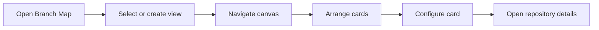
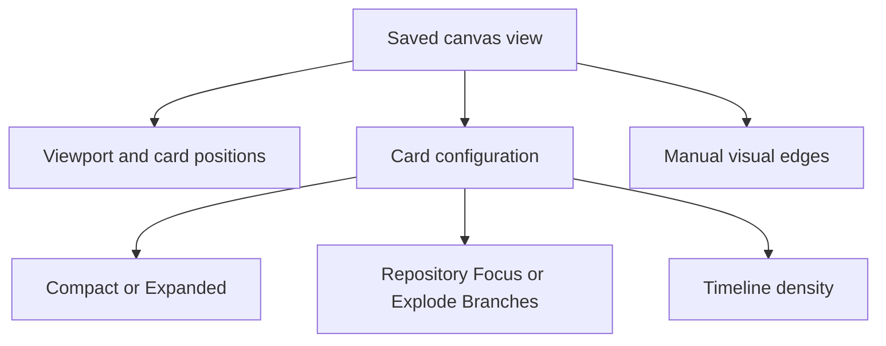

# Branch Map

The Branch Map is an interactive canvas for arranging repository and branch information spatially. Use saved views to keep different working layouts, then move, configure, and connect cards to match the way you think about a workspace.

## Quick Start

1. Open **Branch Map** from the application navigation.
2. Select an existing canvas view or create one from the view controls.
3. Pan and zoom until the workspace is comfortable to inspect.
4. Drag cards into useful positions.
5. Open a card menu to change its display mode or open repository details.

<!-- Screenshot location: Branch Map with view tabs, map toolbar, and several cards. -->

## Canvas Navigation

The map provides controls for:

- Zooming in and out
- Resetting the viewport to its default position and zoom
- Fitting the visible cards into the viewport
- Panning across the canvas
- Dragging cards to new positions
- Connecting cards with visual edges
- Selecting a repository by clicking its card
- Clearing the selection by clicking the empty canvas

Viewport changes and card positions are saved for the active view.

## Canvas Views

Views let you keep separate layouts for different tasks or workspace groupings. The view selector supports the following actions where available:

- Select a view
- Create a view
- Rename a view
- Duplicate a view
- Mark a view as a favorite
- Reorder views
- Archive a view
- Restore an archived view
- Permanently purge an archived view

On smaller screens, some views move into a **More** menu. The visible view tabs support keyboard navigation with the arrow keys, **Home**, and **End**.

The active view stores its own viewport, card positions, visibility settings, card configuration, and manual edges.

<!-- Screenshot location: View selector showing active, favorite, and overflow views. -->

## Configure Cards

Open a card menu to configure how it appears on the map.

### Display Mode

- **Compact** shows a smaller card for high-level layouts.
- **Expanded** provides more room for status and commit timeline information.

### Structure View

- **Repository Focus** keeps the repository represented as a primary card.
- **Explode Branches** expands the repository into branch-level cards when branch data is available.

### Timeline Density

Expanded cards can show a limited number of commits or all available commits with scrolling. The available density choices include 5, 10, 15, or all commits.

Cards can also display status badges, synchronization indicators, commit timelines, tags, and theme colors when that information is available.

<!-- Screenshot location: Expanded card menu showing display mode, structure view, and timeline density. -->

## Levels of Detail

Cards reduce visible detail as you zoom farther out. Close views show the most information, mid-range views reduce detail, and bird's-eye views emphasize the overall arrangement.

While a view is loading, a hydration overlay indicates that the map is updating. Workspace changes received while the map is active can trigger a rehydration of its cards.

## Notes and Limitations

- Resetting the viewport changes the saved viewport for the active view. It does not reset every canvas view.
- Depending on the active configuration, a card can represent a repository or an individual branch.
- Ahead/behind counts and commit information are displayed from the application's backend and cache data. They should not be interpreted as a guarantee of live remote synchronization.
- Manual edges are visual connections created in the canvas. They are not automatically proof of Git commit topology.
- The available cards and branch details depend on tracked repositories and the data available for the current workspace.