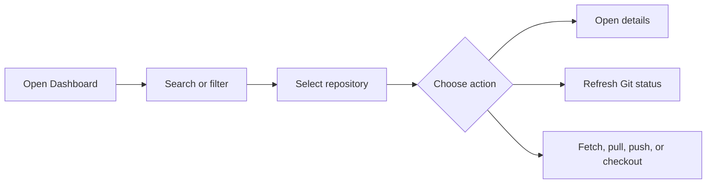
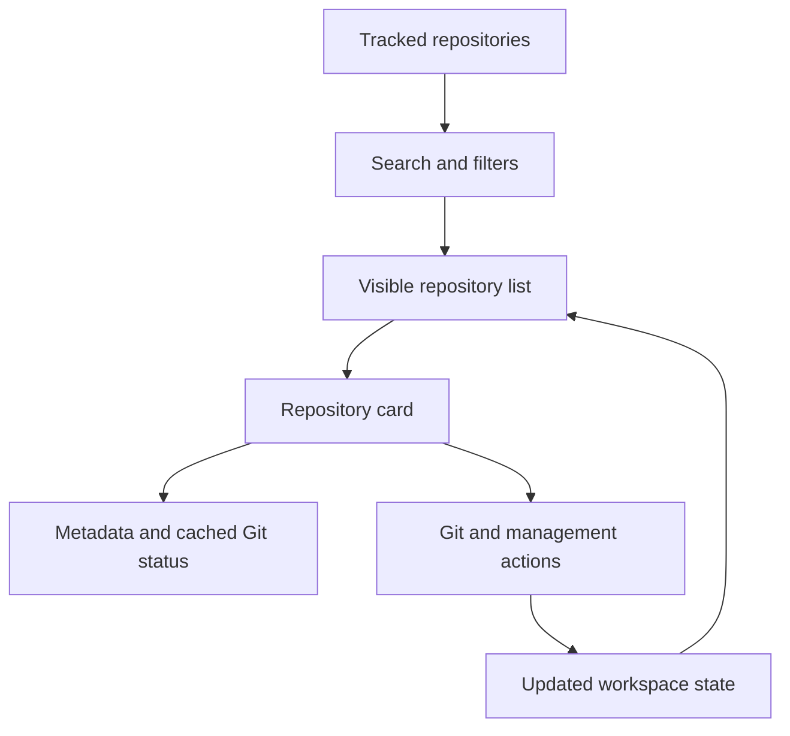

# Dashboard

The Dashboard is the main workspace for tracking and managing local Git repositories. It lets you find repositories quickly, review their current workspace information, and run common Git actions without leaving Branch Schematic.

## Quick Start

1. Open the Dashboard from the main application view.
2. Use the search field to find a repository by display name or local path.
3. Use filters or sorting to narrow the workspace list.
4. Open a repository card to view details and available actions.
5. Refresh status before making a decision when the displayed information may be stale.

<!-- Screenshot location: Dashboard search, filters, and repository list. -->

## Find Repositories

### Search

Search matches both the repository display name and its absolute local path. Clear the search field to return to the full workspace list.

### Filter

The Dashboard supports these repository classifications:

- Owned / Created
- Forks Ecosystem
- Local-Only Frameworks
- Contributors

Additional quick filters include:

- Favorites
- Groups
- Group by owner
- Tags

When tags are available, each tag shows its associated repository count. If unused tags are detected, the Dashboard offers a cleanup action. Cleanup permanently removes tags that are no longer associated with repositories and requires confirmation.

### Sort

Sort the list by:

- Last Accessed
- Alphabetical
- Pending Changes

Pending Changes uses the change count currently available to the application. It is not a substitute for running a fresh status check.

## Manage a Repository

Repository cards can provide the following actions, depending on repository state:

- Refresh branch and workspace status
- Fetch, pull, or push
- Check out another branch
- Open repository details
- Set or clear a custom alias
- Mark the repository as a favorite or pin it
- Assign a group or tags
- Customize its theme color and icon
- Locate or relink a missing repository
- Clone again when the original path is unavailable
- Archive the tracked repository

Git operations can fail because of repository state, credentials, permissions, conflicts, or remote availability. When an action fails, use the displayed notification and refresh the repository before trying again.

<!-- Screenshot location: A repository card showing its branch, status, customization, and action menu. -->

## Bulk Actions

Select multiple repository cards to open the bulk action toolbar. The available bulk actions include:

- Refresh status
- Change theme
- Archive selected repositories
- Clear the selection

Archiving requires confirmation. Archived repositories are not treated as active workspace entries and can be restored through the application's repository management workflow.

<!-- Screenshot location: Selected repository cards and the bulk action toolbar. -->

## How the Dashboard Organizes Data

## Notes and Limitations

- The Dashboard can render cached workspace information while Git status is being refreshed. A displayed value may not represent the latest remote or working-tree state.
- Repository origin labels are Branch Schematic classifications. They should not be treated as an authoritative statement about a Git hosting relationship.
- A missing repository is not automatically discarded. Depending on the state, you can locate the repository, relink it, clone it again, or archive it.
- Archive and unused-tag cleanup are confirmed actions. Tag cleanup cannot be undone through the cleanup dialog.
- Available Git actions vary with repository state, branch configuration, credentials, and remote availability.