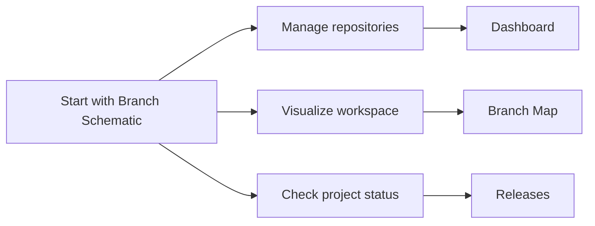

# Docs

Branch Schematic is a desktop workspace for tracking local Git repositories and visualizing repository and branch information. These guides explain the current pre-release application and its main workflows.

## Start Here

Choose the guide that matches what you want to do:

- [Dashboard](/docs/dashboard) — Find, filter, organize, and manage tracked repositories. Use it for repository details and common Git actions.
- [Branch Map](/docs/branch-map) — Arrange repository and branch cards on saved spatial views. Use it to explore workspace relationships visually.
- [Releases](/docs/releases) — Check the pre-release status, official release policy, and roadmap availability.

## Suggested Path

1. Open the **Dashboard** and find or organize the repositories you work with.
2. Open the **Branch Map** when you want to arrange those repositories or branches spatially.
3. Visit **Releases** for the current pre-release status and future documentation updates.

The application and documentation are still pre-release. Feature behavior can change as the project develops; the feature guides describe the behavior currently available in the application.